# Smart Contracts with Solidity

In this project, I programmed three contracts for hypothetical compensation arrangements that may be set up by a company HR:

- `AssociateProfitSplitter` contract that accepts ETH into the contract and divides it evenly among associate-level employees. This will allow the human resources department to pay employees quickly and efficiently. 

- `TieredProfitSplitter` contract that distributes different percentages of incoming ETH to employees at different tiers/levels. For example, the CEO gets paid 60%, CTO 25%, and Bob gets 15%.

- `DeferredEquityPlan` contract that models traditional company stock plans. This contract will automatically manage 1000 shares, with an annual distribution of 250 shares over four years for a single employee.

# Associate Profit Splitter

This hypothetical contract is setup to facilitate the payment to three associate-level employees who are all paid the equal share of all ETH transferred into the contract. The contract can be scaled up to facilitate the payments to a large group of employees. 

The Solidity code is shown in this screenshot:

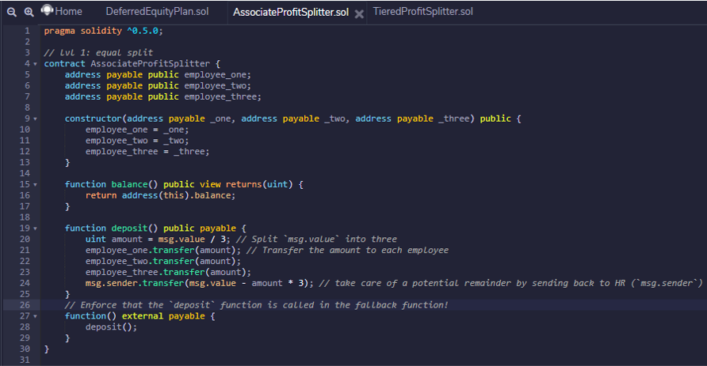

The contract was originally deployed in `Remix` on my local  `Ganache` chain by connecting to `Injected Web3` and ensuring `MetaMask` is pointed to `localhost:8545`.

This contract was deployed from my `Account 4` on my local `Ganache` chain and my `Account 1`, `Account 2` and `Account 3` were designated as `employee_one`, `employee_two` and `employee_three` respectively.

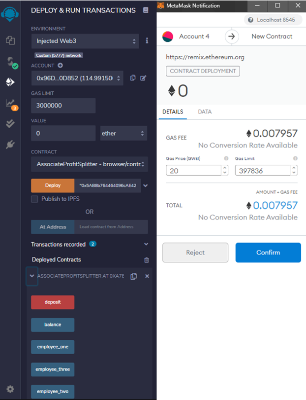

Here is the screenshot of the balance in my `Account 4` (HR) and my "employee" accounts before the the deposit of funds:

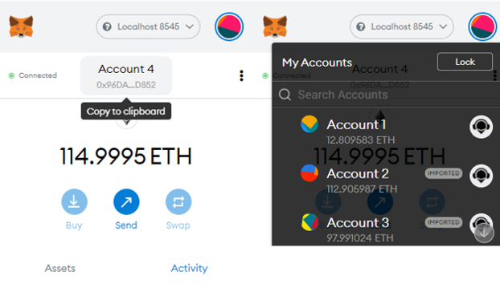

I booked a deposit transaction for ETH 30:

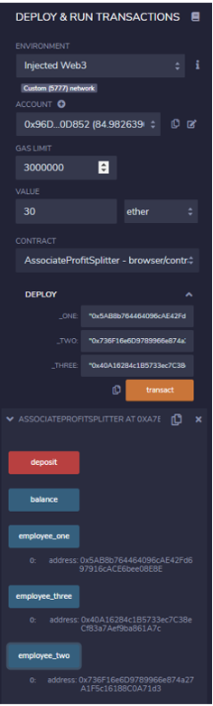
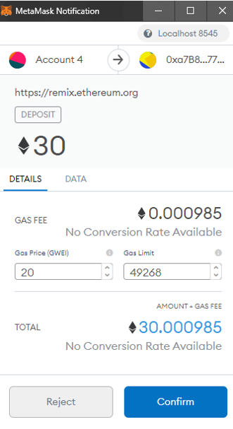

And the balances in my accounts changed accordingly:

- The balance in Account 4 decreased by ETH30 and 
- The balances in my Account1, Account 2 and Account 3 increased by ETH 10 each:

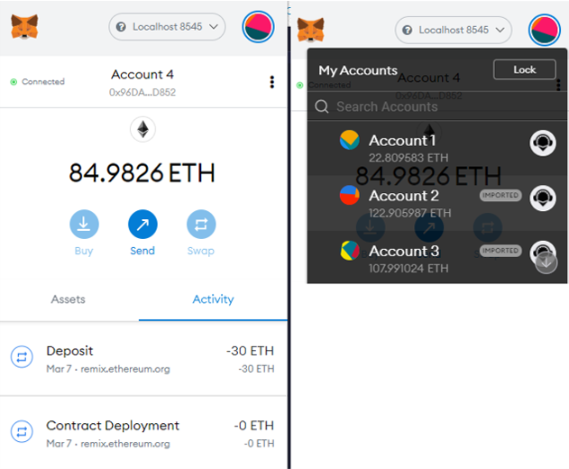

Following this, I deployed `AssociateProfitSplitter` contract on `Ropsten Test Network`:

The contract address is `0x58d586456b5d8D9Da820097a63d83692e78d6f9D` and it can be checked on Etherscan:

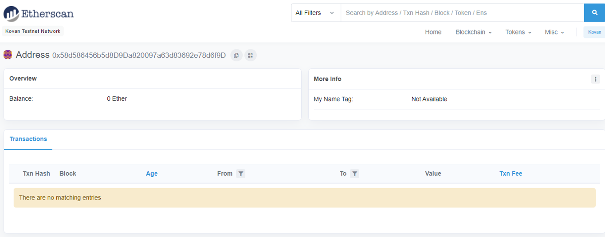

# Tiered Profit Splitter

This hypothetical contract is setup to facilitate the payments to three employees of different seniority who are paid different percentages of incoming ETH payments. In this example the employees are:

- The CEO, who gets paid 60%, 
- The CTO, who gets paid 25% and
- Bob, who gets paid 15%.

The Solidity code is shown in this screenshot:

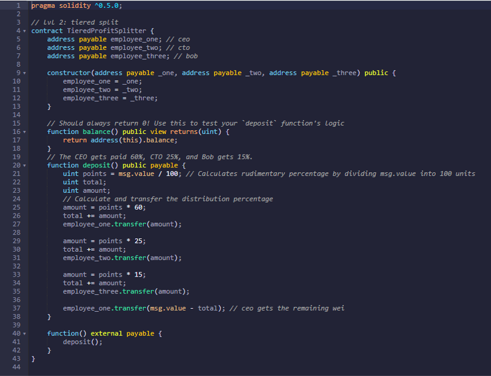

Just like in the first contract, I first set up the contract on my local chain and then deployed it on ‘Ropsten Test Network`.

This contract was deployed from my `Account 4` on my local `Ganache` chain and my `Account 1`, `Account 2` and `Account 3` were designated as `employee_one (CEO)`, `employee_two (CTO)` and `employee_three (Bob)` respectively.

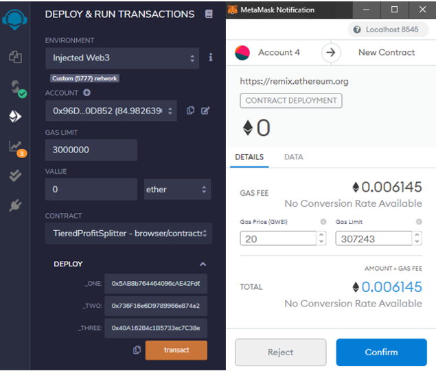

I booked a deposit transaction for ETH 30:
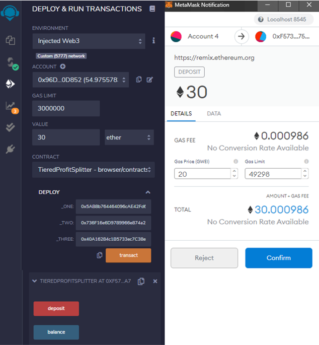

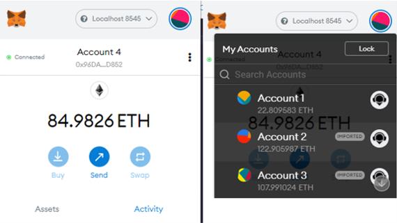

And the balances in my accounts changed accordingly:

- The balance in Account 4 decreased by ETH30 and 
- The balance in my Account1 increased by ETH 18,
- The balance in my Account 2 increased by ETH 7.5,
- The balance in my Account 3 increased by ETH 4.5.

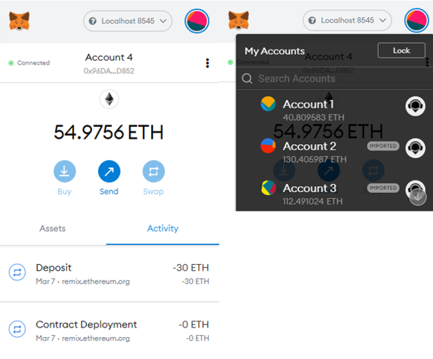

Following this, I deployed `TieredProfitSplitter` contract on `Ropsten Test Network`:
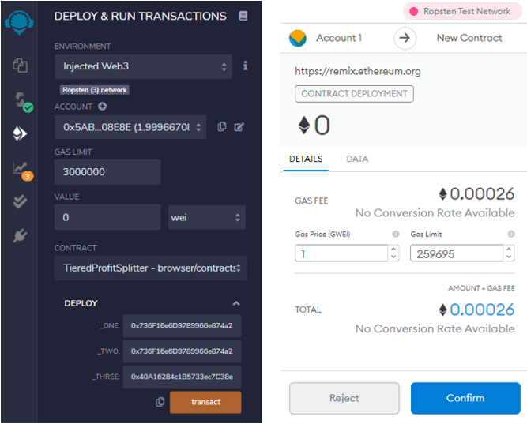

The contract address is `0x1e0692d65a229D987eC0C48a9C9D13Bf82e9d333` and it can be checked on Etherscan:

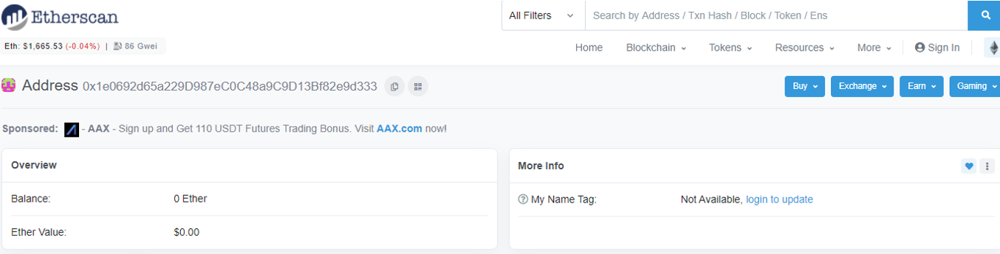